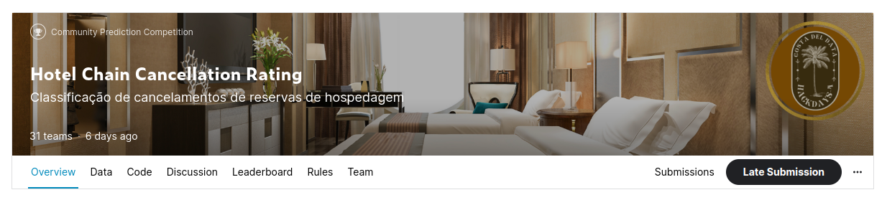
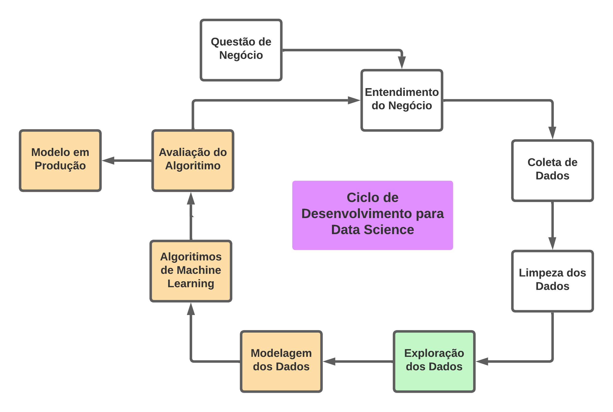
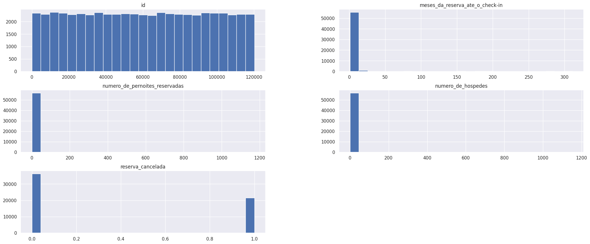
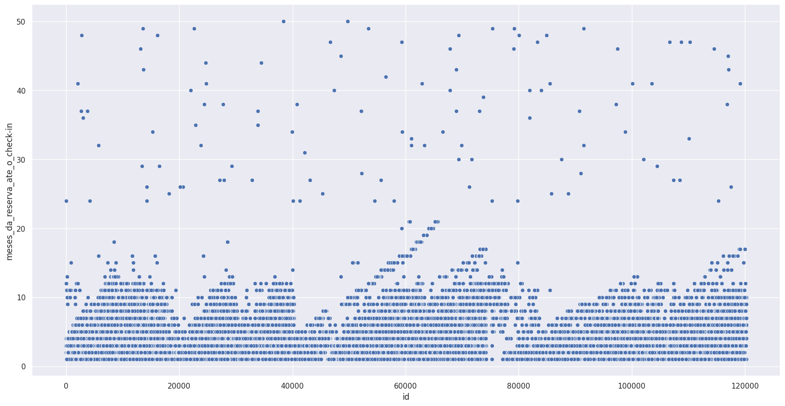
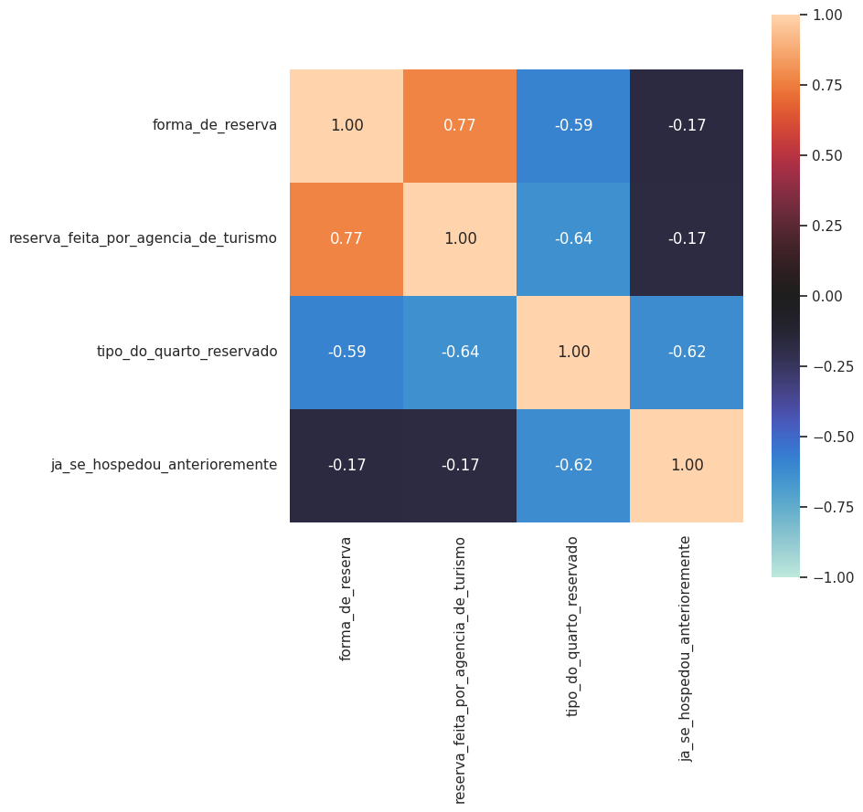

 <h1 align="center"> "Hotel Chain Cancellation Rating" </h1>

# Sejam bem-vindos ao meu projeto de portfólio da competição de dados da Comunidade DS: "Hotel Chain Cancellation Rating"

## 1.0 Contexto do Negócio

Contexto de Negócio
A Costa del Data é uma tradicional rede hoteleira espanhola. Ela possui hoje hotéis de 4 e 5 estrelas em todo o território nacional.

A empresa está preocupada com as suas projeções para os próximos anos, visando a recuperação financeira com o fim das restrições impostas pela pandemia de Covid-19.

Com a reabertura das fronteiras, a diminuição nas restrições de viagem e o aumento das vacinações, era esperado que o setor hoteleiro da Espanha retomasse os ganhos outrora esperados.

Na contramão desta expectativa, a Costa del Data tem visto um aumento em sua taxa de cancelamentos de reservas! A suspeita da diretoria é de que houve uma mudança no comportamento de cancelamentos por parte do consumidor após a pandemia, que ainda não foi compreendida pela rede.

Isso travou ações estratégicas críticas como a expansão da rede hoteleira, a reforma das unidades já com obras programadas, e a realização de ações de marketing direcionadas.

O seu time de cientistas de dados foi contratado, para compreender o fenômeno dos cancelamentos de reservas. Em posse dos resultados, o time de marketing tomará decisões mais assertivas, focando nos públicos com menor incidência de cancelamento, revertendo assim o cenário negativo atual.

Com base no histórico de reservas dos hóspedes, seu time deve desenvolver um modelo de previsão de cancelamentos. O modelo deve prever a variável alvo "Reserva Cancelada", retornando 1 em caso de cancelamento, e 0 em caso de não cancelamento.

Para esta competição, desconsiderem fatores recentes como: conflitos armados, aumento de preços energéticos, acordos comerciais e aprovações orçamentárias que envolvam a Espanha, Europa ou mesmo o mundo.

**Fonte:** [ Kaggle ](https://www.kaggle.com/competitions/cdshackdays4)

## 2.0 Planejamento prévio

* Nesta competição os alunos da Comunidade DS foram separados em Squad's com 5 estudantes cada. Ao todo tivemos 31 Squad's e mais de 180 participantes ao todo.
* O meu Squad teve a seguinte formação:

### O método CRISP-DS foi utilizado como base para o desenvolvimento deste projeto

## 2.1 Ferramentas, IDE's e Bibliotecas

* Python 3.09
* Visual Studio Code
* Jupyter Notebook
* Bibliotecas: Seaborn, Pandas, Numpy, Inflection, Scipy, Dython_Nominal, XGBoost, SKLearn, Category Encoders e LightGBM

## 2.2 Produto final

* Uma solução de classificação que aponte a melhor previsão possível para um cancelamento de uma reserva realizada na rede. Dessa maneira a rede hoteleira poderá tomar as melhores medidas cabíveis, embasada nos perfis dos seus clientes, para poder evitar o cancelamento de reservas já realizadas.

## 3.0 Dados

##### Estes são dados públicos que foram coletados na página web do [Kaggle](https://www.kaggle.com/competitions/cdshackdays4).

## 3.1 Atributos de origem

 Abaixo segue a descrição para cada um dos 15 atributos:  
| **Atributos**                           |  **Tipo**  |  **Descrição**                                               |
| ----------------------------------------|------------|--------------------------------------------------------------|
| id                                      | int64      | Nº de indentificação                                         |
| classificacao_do_hotel                  | object     | Quantidade de estrelas do hotel                              |
| meses_da_reserva_ate_o_check-in         | int64      | Quantidade de meses da reserva até o check-in                |
| numero_de_pernoites_reservadas          | int64      | Nº de pernoites reservados                                   |
| numero_de_hospedes                      | float64    | Nº de de hóspedes                                            |
| regime_de_alimentacao                   | object     | Tipo de refeição inclusa                                     |
| nacionalidade                           | object     | Nacionalidade                                                |
| forma_de_reserva                        | object     | Como a reserva foi realizada                                 |
| ja_se_hospedou_anterioremente           | object     | Se o cliente já se hospedou no hotel                         |
| tipo_do_quarto_reservado                | object     | Tipo de quanrto/suíte                                        |
| reserva_feita_por_agencia_de_turismo    | object     | Se a reserva foi feita em agência de turismo                 |
| reserva_feita_por_empresa               | object     | Se a reserva foi realizada por uma empresa                   |
| reserva_com_estacionamento              | object     | Se a reserva inclui vaga para estacionamento de veículo      |
| reserva_com_observacoes                 | object     | Observações a serem feitas no ato da reserva                 |
| reserva_cancelada                       | int64      | Variável alvo, saber ser haverá cancelamento da reserva      |

## 3.2 Atributos criados

* estrelas_quarto -> o percentual de classificação do quarto entre 4 e 5 estrelas
* combo_alimentacao -> o tipo de regime de alimentação derivado do tipo de quarto
* nights_per_hotel -> a mediana dentre o tipo de quarto locado e a classificação do hotel.

## Visualização dos atributos numéricos em gráfico de barras

## Visualização dos meses da reserva até a data do check-in 

## Visualização da correlação de Atributos Categóricos utilizando a fórmula do Coeficiente de Incerteza de Theil.

## 4.0 Modelagem dos dados

Nesta etapa, os dados foram preparados para o início das aplicações dos modelos de Machine Learning. 
Foram utilizadas técnicas de Rescaling e Transformation, através de encodings e nature transformation.

## 7.1 Machine Learning Modeling

Nesse processo de escolha de modelos de Machine Learning, foram relizados testes e treinamentos com cinco deles, são os seguintes: Random Forest Regressor, XGBoost Regressor, Linear Regression (Lasso), Linear Regression e Average Model. 
Utilizei o Average Model como base para fazer comparações com os demais modelos. 
Apliquei a técnica de Cross Validation para garantir a performance real sobre os dados selecionados. 
Em termos de performance, o Random Forest Regressor se saiu melhor, todavia, eu escolhi o modelo XGBoost Regressor. 
A razão dessa escolha é que o XGBoost é um modelo mais leve para operar em produção e não aparesenta diferença significativa de desempenho.

## Performance

## Cross Validation Performance

## 8.0 Avaliação do Algorítimo

Hyperparameter Tunning:

Aqui eu realizei diversos testes de desempenho a partir das variações de ajustes dos parâmetros do algoritmo, fiz o uso da técnica de Random Search para poder encontrar os melhores ajustes finais. No final a acurácia do XGBoost ficou na melhor posição e pude economizar tempo e dinheiro, já que não foram necessárias máquinas de Cloud Computing para poder executar os testes mais pesados, computacionalmente falando.

Desempenho dos dados de teste:

## 8.1 Tradução e interpretação de erros

Chegamos então a demonstração do resultado final do projeto. Avaliei a performance do modelo com viés voltado ao negócio. 
Aqui apresento o resultado financeiro e as margens de erro do modelo, tanto para o melhor cenário, quanto para o pior cenário. 
Os valores totais representam a soma de todo o faturamento das lojas para as próximas seis semanas.

## Predições do Modelo de Machine Learning

## 9.0 Implementação do bot no Telegram

Neste último passo realizei a implementação de um bot no Telegram para que qualquer usuário com acesso à internet possa solicitar os resultados das predições do modelo de Machine Learning. Este processo é realizado individualmente, ou seja, pode ser solicitada a prediçao por loja única da rede de vendas. 
O bot foi criado dentro da própria plataforma do Telegram e o mesmo foi conectado ao serviço de Cloud do Render. O modelo de predição em Python passa então a operar 24/7.

