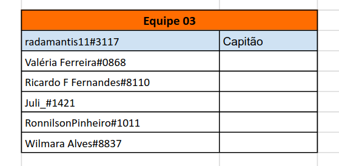

 <h1 align="center"> "Hotel Chain Cancellation Rating" </h1>

# Sejam bem-vindos ao meu projeto de portfólio da competição de dados da Comunidade DS: "Hotel Chain Cancellation Rating"

## 1.0 Contexto do Negócio

Contexto de Negócio
A Costa del Data é uma tradicional rede hoteleira espanhola. Ela possui hoje hotéis de 4 e 5 estrelas em todo o território nacional.

A empresa está preocupada com as suas projeções para os próximos anos, visando a recuperação financeira com o fim das restrições impostas pela pandemia de Covid-19.

Com a reabertura das fronteiras, a diminuição nas restrições de viagem e o aumento das vacinações, era esperado que o setor hoteleiro da Espanha retomasse os ganhos outrora esperados.

Na contramão desta expectativa, a Costa del Data tem visto um aumento em sua taxa de cancelamentos de reservas! A suspeita da diretoria é de que houve uma mudança no comportamento de cancelamentos por parte do consumidor após a pandemia, que ainda não foi compreendida pela rede.

Isso travou ações estratégicas críticas como a expansão da rede hoteleira, a reforma das unidades já com obras programadas, e a realização de ações de marketing direcionadas.

O seu time de cientistas de dados foi contratado, para compreender o fenômeno dos cancelamentos de reservas. Em posse dos resultados, o time de marketing tomará decisões mais assertivas, focando nos públicos com menor incidência de cancelamento, revertendo assim o cenário negativo atual.

Com base no histórico de reservas dos hóspedes, seu time deve desenvolver um modelo de previsão de cancelamentos. O modelo deve prever a variável alvo "Reserva Cancelada", retornando 1 em caso de cancelamento, e 0 em caso de não cancelamento.

Para esta competição, desconsiderem fatores recentes como: conflitos armados, aumento de preços energéticos, acordos comerciais e aprovações orçamentárias que envolvam a Espanha, Europa ou mesmo o mundo.

**Fonte:** [ Kaggle ](https://www.kaggle.com/competitions/cdshackdays4)

## 2. Planejamento prévio

* Nesta competição os alunos da Comunidade DS foram separados em Squad's com 5 estudantes cada. Ao todo tivemos 31 Squad's e mais de 180 participantes ao todo.
* O meu Squad teve a seguinte formação:

### Método CRISP-DS

## 2.1 Ferramentas, IDE's e Bibliotecas

* Python 3.09
* Visual Studio Code
* Jupyter Notebook
* Bibliotecas: Seaborn, Plotly, Plotly Express, Pandas, Numpy, XGBoost, SKLearn e MatPlotLib

## 2.2 Produto final

* 

## 4.0 Dados

##### Estes são dados públicos que foram coletados na página web do [Kaggle](https://www.kaggle.com/competitions/cdshackdays4).

## 4.1 Atributos de origem

 Abaixo segue a descrição para cada um dos 15 atributos:  
| **Atributos**         |  **Descrição**  |
| ----------------------|------------------------------------------------------------------------------------------|
|  id                   | um Id que representa um (Store, Date) concatenado dentro do conjunto de teste |
|  Store                |  um id único para cada loja |
|  Sales                |  o volume de vendas em um determinado dia |
|  Customers            |  o número de clientes em um determinado dia |
|  Open                 |  um indicador para saber se a loja estava aberta: 0 = fechada, 1 = aberta |
|  StateHoliday         |  indica um feriado estadual. Normalmente todas as lojas, com poucas exceções, fecham nos feriados estaduais. Observe que todas as escolas fecham nos feriados e finais de semana. a = feriado, b = feriado da Páscoa, c = Natal, 0 = Nenhum |
| SchoolHoliday         |  indica se (Store, Date) foi afetada pelo fechamento de escolas públicas |
|  StoreType            |  diferencia entre 4 modelos de loja diferentes: a, b, c, d |
|  Assortment           |  descreve um nível de sortimento: a = básico, b = extra, c = estendido |
|  CompetitionDistance  |  distância em metros até a loja concorrente mais próxima |
|  CompetitionOpenSince |  apresenta o ano e mês aproximados em que o concorrente mais próximo foi aberto |
|  Promo                |  indica se uma loja está fazendo uma promoção naquele dia |
|  Promo2               |  Promo2 é uma promoção contínua e consecutiva para algumas lojas: 0 = a loja não está participando, 1 = a loja está participando |
|  Promo2Since          |  descreve o ano e a semana em que a loja começou a participar da Promo2 |
|  PromoInterval        | descreve os intervalos consecutivos de início da promoção 2, nomeando os meses em que a promoção é iniciada novamente. Por exemplo. "Fev, maio, agosto, novembro" significa que cada rodada começa em fevereiro, maio, agosto, novembro de qualquer ano para aquela loja |

## 4.2 Atributos criados

* competition_open_since_month -> A quantidade de meses desde de que uma loja competidora próxima foi aberta.
* competition_open_since_year -> A quantidade de anos desde de que uma loja competidora próxima foi aberta.
* promo2_since_week -> A quantidade de semanas desde a última promoção categoria 2.
* promo2_since_year -> A quantidade de anos desde a última promoção categoria 2.
* promo_interval -> O intervalo entre promoções na mesma loja
* month_map -> Mapeamento dos meses 1: 'Jan', 2: 'Fev', 3: 'Mar', 4: 'Apr', 5: 'May', 6: 'Jun', 7: 'Jul', 8: 'Aug', 9: 'Sep', 10: 'Oct', 11: 'Nov' e 12: 'Dec'

## 7.0 Modelagem dos dados

Nesta etapa, os dados foram preparados para o início das aplicações dos modelos de Machine Learning. 
Foram utilizadas técnicas de Rescaling e Transformation, através de encodings e nature transformation. O pacote Boruta foi aplicado para direcionar quais são os melhores atributos e, dessa maneira, treinar o melhor modelo afim de se obter uma melhor acurácia.

## 7.1 Machine Learning Modeling

Nesse processo de escolha de modelos de Machine Learning, foram relizados testes e treinamentos com cinco deles, são os seguintes: Random Forest Regressor, XGBoost Regressor, Linear Regression (Lasso), Linear Regression e Average Model. 
Utilizei o Average Model como base para fazer comparações com os demais modelos. 
Apliquei a técnica de Cross Validation para garantir a performance real sobre os dados selecionados. 
Em termos de performance, o Random Forest Regressor se saiu melhor, todavia, eu escolhi o modelo XGBoost Regressor. 
A razão dessa escolha é que o XGBoost é um modelo mais leve para operar em produção e não aparesenta diferença significativa de desempenho.

## Performance

## Cross Validation Performance

## 8.0 Avaliação do Algorítimo

Hyperparameter Tunning:

Aqui eu realizei diversos testes de desempenho a partir das variações de ajustes dos parâmetros do algoritmo, fiz o uso da técnica de Random Search para poder encontrar os melhores ajustes finais. No final a acurácia do XGBoost ficou na melhor posição e pude economizar tempo e dinheiro, já que não foram necessárias máquinas de Cloud Computing para poder executar os testes mais pesados, computacionalmente falando.

Desempenho dos dados de teste:

## 8.1 Tradução e interpretação de erros

Chegamos então a demonstração do resultado final do projeto. Avaliei a performance do modelo com viés voltado ao negócio. 
Aqui apresento o resultado financeiro e as margens de erro do modelo, tanto para o melhor cenário, quanto para o pior cenário. 
Os valores totais representam a soma de todo o faturamento das lojas para as próximas seis semanas.

## Predições do Modelo de Machine Learning

## 9.0 Implementação do bot no Telegram

Neste último passo realizei a implementação de um bot no Telegram para que qualquer usuário com acesso à internet possa solicitar os resultados das predições do modelo de Machine Learning. Este processo é realizado individualmente, ou seja, pode ser solicitada a prediçao por loja única da rede de vendas. 
O bot foi criado dentro da própria plataforma do Telegram e o mesmo foi conectado ao serviço de Cloud do Render. O modelo de predição em Python passa então a operar 24/7.

